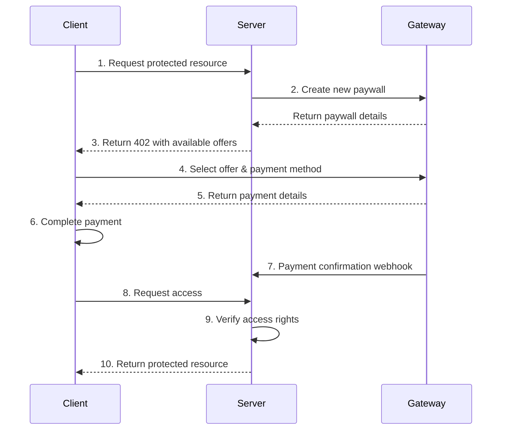

# L402 Protocol Demo

This repository demonstrates a complete implementation of the L402 protocol, which enables seamless payment flows over HTTP for data providers and consumers. This demo showcases how data providers can monetize their APIs and datasets while providing a smooth payment experience for clients.

## Overview

The L402 protocol allows servers to:
- Define flexible payment offers (one-time purchases, subscriptions, or top-ups)
- Communicate pricing and payment requirements through standard HTTP
- Grant access to protected resources upon (out-band) payment

In a production environment, [Fewsats](https://fewsats.com) typically provides the gateway service, handling all payment processing and security aspects. This demo includes an open-source gateway implementation to help you understand and experiment with the complete flow.

For the complete L402 protocol specification, please visit the [L402 Protocol Repository](https://github.com/l402-protocol/l402).

## Components

### 1. Server (Your Data Service)
The server represents your data service that wants to monetize access to specific resources:
- Defines available payment **offers** (pricing, types, payment methods)
- Protects valuable endpoints requiring payment
- Receives payment confirmations automatically (webhook)
- Grants access to paid resources

### 2. Gateway (Fewsats in Production)
The gateway handles all payment-related operations:
- Processes payment requests
- Manages checkout flows
- Supports multiple payment methods
- Notifies the server of successful payments
- Provides a secure payment infrastructure

In production, Fewsats provides this component as a managed service with additional features and security.

### 3. Client (Your Customers)
The client demonstrates how your customers will interact with your protected resources:
- Makes requests to access protected data
- Receives structured payment requirements
- Processes payments through the gateway
- Gains access to paid resources

## Payment Flow

1. Client attempts to access a protected resource
2. Server requests gateway to create a new paywall
3. Server returns payment requirements (402) with offer details
4. Client selects offer and payment method
5. Gateway provides specific payment details
6. Client completes payment
7. Gateway notifies server via webhook
8. Client tries to access resource
9. Server verifies access rights
10. Server returns protected resource



## Production Gateway

If you want to use a hosted gateway that handles payments with credit card, lightning, and stablecoins while managing all payment-related complexities, you can use [Fewsats](https://fewsats.com). Fewsats provides a production-ready gateway with:

- Multiple payment methods (credit cards, Lightning Network, cryptocurrencies)
- Secure payment processing
- Automated webhook notifications
- Simple integration through SDKs

For easy integration, check out the [Fewsats Python SDK](https://fewsats.github.io/fewsats-python/) which provides tools for both payment processing and AI agent integration.

## Getting Started

### Prerequisites
- Go 1.21 or later
- Make (optional, for using the provided Makefile)

### Quick Start

1. Clone this repository:
```bash
git clone https://github.com/l402-protocol/go-example
cd go-example
```

2. Start all components (server and gateway):
```bash
make serve-server
make serve-gateway
```

This will start:
- Your data service (server) on :8080
- Payment gateway on :8081

3. Try the demo flow:

View available payment offers:
```bash
go run cmd/client/main.go
```

When you first run the client without any flags, you'll see that the mock wallet cannot process the payment, and you'll receive information about the available offers.

To simulate a successful payment flow, use the `--fake` flag:
```bash
go run cmd/client/main.go --fake --offer-id=offer_0001
```

After the payment is processed successfully, you'll be able to access the protected resource. This demonstrates the complete L402 flow from payment to resource access.


### Example Offers

The demo includes three example offers to showcase different payment models:

1. **Pro Credits** (offer_0001)
   - 10 credits for dataset access
   - $10 USD
   - Payment via Lightning Network or mock provider

2. **Single Dataset** (offer_0002)
   - Unlimited access to one dataset
   - $100 USD
   - Payment via Lightning Network, On-chain Bitcoin, or mock provider

3. **Unlimited Access** (offer_0003)
   - Unlimited access to all datasets
   - $500 USD
   - Payment via Lightning Network, On-chain Bitcoin, Credit Card, or mock provider


Clean built binaries:
```bash
make clean
```

## Integration with Fewsats

While this demo uses an open-source gateway implementation, in production, you would integrate with Fewsats' secure gateway service, which provides:

- Production-ready payment processing
- Enhanced security features
- Multiple payment method support
- Real-time payment notifications
- Dashboard and analytics
- Technical support

Contact [Fewsats](https://fewsats.com) to learn more about integrating L402 into your data service.

## Support

For questions about this demo, please open an issue in this repository.
For questions about Fewsats' services, please contact us through our website.

